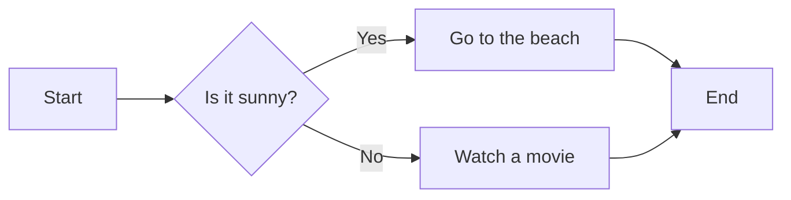

# gplearnplus
升级后的gplearn， 支持包含时序和截面参数的自定义函数，例如均线

# 文件描述

## `_Program.py`

定义，生成树型对象，定义交叉变异方法
### 初始化方法


### 表达式
数据类型为：函数为_Function对象，变量为数字字符串，常数为数字


## `fitness.py`

定义适应度函数，和自定义适应函数的方法


## `function.py`

自定义函数和构建方法
定义函数对象`_Function`
包含是属性：

`function`：可调用函数

`name`：函数名

`arity`：参数个数

`param_type`：参数类型列表，长度与arity一致，默认不接受分类类型
该设计是本项目最重要的升级，影响公式树的构建
```python
[{
'vector': {'category': (None, None), 'number': (None, None)},
'scalar': {'int': (None, None), 'float': (None, None)}
},]
```

`function_type`：函数类型
'all', 'section', 'time_series‘

`return_type`：返回类型
'number', 'category'


## `genetic.py`

模型接口，包括由工厂类派生出，回归，分类器和特征工程工具类，应用于不同场景


## `utils.py`

支持函数


`test.py`

自定义函数样例


# 函数文档

## 全局函数

### gpelarn自带全局函数

### 自定义全局函数
| 函数名          | 实现逻辑         | 参数要求                   | 输出类型     |
| --------------- | ---------------- | -------------------------- | ------------ |
| combine（X, Y） | 拼接两个分类变量 | 【分类向量】，【分类向量】 | 【分类向量】 |


## 时间序列函数

### 基本时间序列函数
| 函数名                | 实现逻辑      | 参数要求            | 输出类型     |
|--------------------|-----------| ------------------- | ------------ |
| delay（X,d）         | 时序变量滞后    | 【数值向量】，【整形常量】 | 【数值向量】 |
| delta（X,d）         | 与滞后项作差    | 【数值向量】，【整形常量】 | 【数值向量】 |
| ts_min（X,d）        | 时间窗口最小值   | 【数值向量】，【整形常量】 | 【数值向量】 |
| ts_max（X,d）        | 时间窗口最大值   | 【数值向量】，【整形常量】 | 【数值向量】 |
| ts_argmax（X,d）     | 时间窗口最小值位置 | 【数值向量】，【整形常量】 | 【数值向量】 |
| ts_argmin（X,d）     | 时间窗口最大值位置 | 【数值向量】，【整形常量】 | 【数值向量】 |
| ts_rank（X, d）      | 时间窗口排序值   | 【数值向量】，【整形常量】 | 【数值向量】 |
| ts_sum（X, d）       | 时间窗口求和    | 【数值向量】，【整形常量】 | 【数值向量】 |
| ts_stddev（X, d）    | 时间窗口标准差   |  【数值向量】，【整形常量】 |  【数值向量】  |
| ts_corr（X,Y,d）     | 时间窗口相关系数  |  【数值向量】，【数值向量】，【整形常量】 |  【数值向量】  |
| ts_mean（X, d）      | 时间窗口均值    |  【数值向量】，【整形常量】 |  【数值向量】  |
| ts_neutralize（X, d） | 时间窗口Z分数   |  【数值向量】，【整形常量】 |  【数值向量】  |
| ts_freq（X, d）      | 时间窗口Z分数   |  【数值向量】，【整形常量】 |  【数值向量】  |

### 技术指标函数

| 函数名                 | 实现逻辑       | 参数要求            | 输出类型     |
|---------------------|------------| ------------------- | ------------ |
| EMA（X,d）            | 指数平滑均线     | 【数值向量】，【整形常量】 | 【数值向量】 |
| DEMA（X,d）           | 二重指数平滑线    | 【数值向量】，【整形常量】 | 【数值向量】 |
| MA（X,d）             | 均线         | 【数值变量】，【整形常量】 | 【数值向量】 |
| KAMA（X,d）           | 库夫曼自适应移动均线 | 【数值向量】，【整形常量】 | 【数值向量】 |
| MIDPOINT（X,d）       | 中间点        | 【数值向量】，【整形向量】 | 【数值向量】 |
| BETA（X,Y,d）         | 回归系数       | 【数值向量】，【数值向量】，【整形常量】 | 【数值向量】 |
| LINEARREG_SLOPE（X, d）       | 回归斜率       | 【数值向量】，【整形常量】 | 【数值向量】 |
| LINEARREG_ANGLE（X, d）       | 回归角度       | 【数值向量】，【整形常量】 | 【数值向量】 |
| LINEARREG_INTERCEPT（X, d）     | 回归截距       |  【数值向量】，【整形常量】 |  【数值向量】  |

## 截面函数
### 基本截面函数
| 函数名                                | 实现逻辑     | 参数要求             | 输出类型   |
|------------------------------------|----------|------------------|--------|
| MAX_SECTION（X）                     | 最大值填充    | 【数值向量】           | 【数值向量】 |
| MIN_SECTION（X）                     | 最小值填充    | 【数值向量】           | 【数值向量】 |
| MEAN_SECTION（X）                    | 均值填充     | 【数值向量】           | 【数值向量】 |
| MEDIAN_SECTION（X）                  | 中位数填充    | 【数值向量】           | 【数值向量】 |
| STD_SECTION（X）                     | 标准差填充    | 【数值向量】           | 【数值向量】 |
| RANK_SECTION（X）                    | 序数填充     | 【数值向量】           | 【数值向量】 |
| NEUTRALIZE_SECTION（X）              | Z分数填充    | 【数值向量】           | 【数值向量】 |
| FREQ_SECTION（X）                    | 频数填充     | 【分类向量】           | 【数值向量】 |
| CUT_EQUAL_DISTANCE（X, d）           | 等距分组     | 【数值向量】，【整形标量】    | 【数值向量】 |
| CUT_EQUAL_AMOUNT（X, d）             | 等量分组     | 【数值向量】，【整形标量】    | 【数值向量】 |

### 截面分类聚合函数

| 函数名                                | 实现逻辑     | 参数要求             | 输出类型   |
|------------------------------------|----------|------------------|--------|
| GROUPBYTHENMAX（gbx, X）             | 分组后取最大值  | 【分类向量】，【数值向量】    | 【数值向量】 |
| GROUPBYTHENMIN（gbx, X）             | 分组后取最小值  | 【分类向量】，【数值向量】    | 【数值向量】 |
| GROUPBYTHENMEAN（gbx, X）            | 分组后取均值   | 【分类向量】，【数值向量】    | 【数值向量】 |
| GROUPBYTHENMEDIAN（gbx, X）          | 分组后取中位数  | 【分类向量】，【数值向量】    | 【数值向量】 |
| GROUPBYTHENSTD（gbx, X）             | 分组后取标准差  | 【分类向量】，【数值向量】    | 【数值向量】 |
| GROUPBYTHENRANK（gbx, X）            | 分组后取序数   | 【分类向量】，【数值向量】    | 【数值向量】 |
| GROUPBYTHENNEUTRALIZE（gbx, X）      | 分组后取Z分数  | 【分类向量】，【数值向量】    | 【数值向量】 |
| GROUPBYTHEN_CUT_EQ_DIST（gbx, X, d） | 分组后取等距分组 | 【分类向量】，【数值向量】，【整形常量】 | 【数值向量】 |
| GROUPBYTHEN_CUT_EQ_AMT（gbx, X, d）  | 分组后取等量分组 | 【分类向量】，【数值向量】，【整形常量】 | 【数值向量】 |
| GROUPBYTHENFREQ（gbx, X）            | 分组后取取频数  | 【分类向量】，【数值向量】    | 【数值向量】 |
# 更新记录

## v1.0

未调试完全， 有bug

## v1.1

处理完funtions模块的问题
调试成功，对于时序自定义函数中的常数参数，需要在函数中做去广播判定

## v1.2

test中加入了自定义函数的定义方法，需要忽略运行时的RuntimeWarning

## v1.3

functions中去掉了对于function.__code__.co_argument的限制
增强对函数修饰器的兼容

## v1.4
test.py debug
函数定义考虑特殊参数情况

## v1.5
新增面板数据支持功能
将场景分位截面，时序和面板
数据定义要求更新

函数定义要求更新

更新适应度惩罚计算

修改遗传规划中的特征筛选逻辑
（当最大相关系数绝对值低于某一阈值时，直接按fitness筛选）