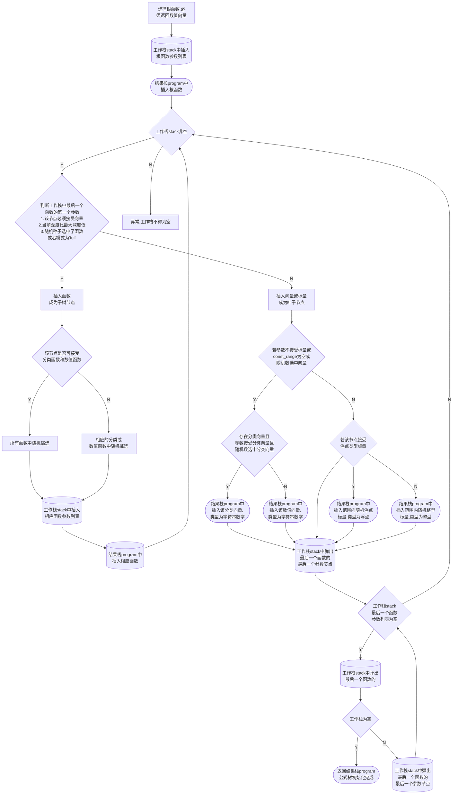

# gplearnplus
对gplearn进行升级，适应时序数据和面板数据，适用于更多的场景
且在函数参数中区分分类数据和数值型数据，可兼容类似于groupby等操作

# 文件描述

## `_Program.py`
构建，调用公式树模块，
对象为`_Program`
属性`program`为栈形式的公式树
### 公式树形式


该公式表达是为

$$
((X_0 \times X_0) - (3.0 \times X_1)) + 0.5
$$

program结果栈为：
`['add', 'sub', 'mul', '0', '0', 'mul', 3.0, '1', 0.5]`

### 初始化方法
`build_program`
通过stack对树进行深度优先搜索构建

### 树的检验
`validate_program`
对树一次深度优先搜索，保证所有节点完备，即每一个函数参数量足够

`_depth`
深度优先搜索的同时记录最大深度

`_length`
返回program长度，即树的节点数量

### 树的打印
`__str__`：打印树
`export_graphviz`：可视化整个树


### 公式树的计算
`execute`：接受pandas或者二位nd_array，shape = [n_samples, n_features]
执行过程中，将program中的字符串和常数处理成可接受参数
- 常数需要广播成常向量
- 字符串转换为输入X中对应的列
- 若数据类型为面板数据`panel`，X中需要额外输入证券列和时间列，

`raw_fitness`：原始适应度
1. 由公式树计算出$\hat{y}$
2. 对$\hat{y}$进行调整
3. 计算$y$与$\hat{y}$的适应度`metric`

`fitness`：带惩罚项适应度
$$
penalty=p\_coef \times program\_len \times sign(metric)
$$
### 样本选择(防止过拟合)
为了防止过拟合，仅选择部分样本

`get_all_indices` 输入总样本量和抽样样本量

返回抽样内样本index和抽样外样本index

### 公式树的截取

`get_subtree(random_state, start, program=None)`：获取指定子树
获取根节点为start的指定子树


`get_random_subtree(random_state, program=None, return_type=None):`获取随机子树
根据需要设定获取**数值型子树**还是**分类型子树**
返回子树和子树类型

### 公式树的交叉变异

`crossover(donor, random_state)`
与公式树`donor`交叉，要求同返回类型

`subtree_mutation(random_state)`
随机生成一颗公式树，与父树交叉

`hoist_mutation(random_state)`
首先寻找可以hoist的节点，要求该节点下存在子节点与自己类型相同
把一颗子树的同类型子树上提

`point_mutation(random_state)`
点变异
对随机选中的点进行点变异
点变异保证函数合法


## `fitness.py`

定义适应度函数，和自定义适应函数的方法

定义函数对象`_Fitness`

包含是属性：

`function`

必须接受三个变量`(y, y_perd, w)`

`greater_is_better`


## `function.py`

自定义函数和构建方法
定义函数对象`_Function`
包含是属性：

`function`：可调用函数

`name`：函数名

`arity`：参数个数

`param_type`：
参数类型列表，长度与arity一致，**默认不接受分类类型**
该设计是本项目最重要的升级，影响公式树的构建
```python
[{
'vector': {'category': (None, None), 'number': (None, None)},
'scalar': {'int': (None, None), 'float': (None, None)}
},]
```

`function_type`：函数类型 默认 'all'
'all', 'section', 'time_series‘

`return_type`：返回类型 默认'number'
'number', 'category'

包含的方法：

`__call__`
调用函数特殊处理，
参数仅接受标量，却传入向量
则取向量第一个值为标量

`add_range`:

替换掉参数中没有约束的范围，给所有标量限制范围

若没有const_range, 则表明所有函数不接收常数， 去掉所有的const type

`is_point_mutation(candidate_func)`

检验某个待替换函数是否可以替换

外部函数：
`make_function(*, function, name, arity, param_type=None, wrap=True, return_type='number', function_type='all')`
将函数处理为_Funtion对象
主要进行合法性检验和测试

## `genetic.py`

模型接口，包括由工厂类派生出，回归，分类器和特征工程工具类，应用于不同场景

### '_parallel_evolve(n_programs, parents, X, y, sample_weight, seeds, params)'

进行一次种群进化
n_programs为种群数量


### `BaseSymbolic`


## `utils.py`

支持函数


`test.py`


`data_trans.py`


自定义函数样例


# 函数文档

## 全局函数

### gpelarn自带全局函数
| 函数名       | 实现逻辑            | 参数要求          | 输出类型     |
|-----------|-----------------|---------------| ------------ |
| add（X, Y） | 向量相加            | 【数值向量】，【数值向量】 | 【数值向量】 |
| sub（X, Y） | 向量相减            | 【数值向量】，【数值向量】 | 【数值向量】 |
| mul（X, Y） | 向量相乘            | 【数值向量】，【数值向量】 | 【数值向量】 |
| div（X, Y） | 向量相除（极小值替换分母0）  | 【数值向量】，【数值向量】 | 【数值向量】 |
| sqrt（X）   | 开平方（负数处理为绝对值）   | 【数值向量】 | 【数值向量】 |
| log（X）    | 取自然对数（同理处理0和负数） | 【数值向量】 | 【数值向量】 |
| neg（X）    | 取反数             | 【数值向量】 | 【数值向量】 |
| inv（X）    | 取倒数  （极小值处理0）   | 【数值向量】 | 【数值向量】 |
| abs（X）    | 取绝对值            | 【数值向量】 | 【数值向量】 |
| max（X, Y） | 向量取孰大值          | 【数值向量】，【数值向量】 | 【数值向量】 |
| min（X, Y） | 向量取孰小值          | 【数值向量】，【数值向量】 | 【数值向量】 |
| sin（X）    | 取向量正弦           | 【数值向量】， | 【数值向量】 |
| cos（X）    | 取向量余弦           | 【数值向量】 | 【数值向量】 |
| tan（X）    | 取向量正切           | 【数值向量】 | 【数值向量】 |
| sig（X）    | 逻辑斯蒂函数          | 【数值向量】 | 【数值向量】 |
### 自定义全局函数
| 函数名          | 实现逻辑       | 参数要求                   | 输出类型     |
| --------------- |------------| -------------------------- | ------------ |
| combine（X, Y） | 两个分类变量笛卡尔积 | 【分类向量】，【分类向量】 | 【分类向量】 |


## 时间序列函数

### 基本时间序列函数
| 函数名                | 实现逻辑      | 参数要求                 | 输出类型     |
|--------------------|-----------|----------------------| ------------ |
| delay（X,d）         | 时序变量滞后    | 【数值向量】，【整形常量】        | 【数值向量】 |
| delta（X,d）         | 与滞后项作差    | 【数值向量】，【整形常量】        | 【数值向量】 |
| ts_min（X,d）        | 时间窗口最小值   | 【数值向量】，【整形常量】        | 【数值向量】 |
| ts_max（X,d）        | 时间窗口最大值   | 【数值向量】，【整形常量】        | 【数值向量】 |
| ts_argmax（X,d）     | 时间窗口最小值位置 | 【数值向量】，【整形常量】        | 【数值向量】 |
| ts_argmin（X,d）     | 时间窗口最大值位置 | 【数值向量】，【整形常量】        | 【数值向量】 |
| ts_rank（X, d）      | 时间窗口排序值   | 【数值向量】，【整形常量】        | 【数值向量】 |
| ts_sum（X, d）       | 时间窗口求和    | 【数值向量】，【整形常量】        | 【数值向量】 |
| ts_stddev（X, d）    | 时间窗口标准差   | 【数值向量】，【整形常量】        |  【数值向量】  |
| ts_corr（X,Y,d）     | 时间窗口相关系数  | 【数值向量】，【数值向量】，【整形常量】 |  【数值向量】  |
| ts_mean（X, d）      | 时间窗口均值    | 【数值向量】，【整形常量】        |  【数值向量】  |
| ts_neutralize（X, d） | 时间窗口Z分数   | 【数值向量】，【整形常量】        |  【数值向量】  |
| ts_freq（X, d）      | 时间窗口Z分数   | 【分类向量】，【整形常量】        |  【数值向量】  |

### 技术指标函数

| 函数名                 | 实现逻辑       | 参数要求            | 输出类型     |
|---------------------|------------| ------------------- | ------------ |
| EMA（X,d）            | 指数平滑均线     | 【数值向量】，【整形常量】 | 【数值向量】 |
| DEMA（X,d）           | 二重指数平滑线    | 【数值向量】，【整形常量】 | 【数值向量】 |
| MA（X,d）             | 均线         | 【数值变量】，【整形常量】 | 【数值向量】 |
| KAMA（X,d）           | 库夫曼自适应移动均线 | 【数值向量】，【整形常量】 | 【数值向量】 |
| MIDPOINT（X,d）       | 中间点        | 【数值向量】，【整形向量】 | 【数值向量】 |
| BETA（X,Y,d）         | 回归系数       | 【数值向量】，【数值向量】，【整形常量】 | 【数值向量】 |
| LINEARREG_SLOPE（X, d）       | 回归斜率       | 【数值向量】，【整形常量】 | 【数值向量】 |
| LINEARREG_ANGLE（X, d）       | 回归角度       | 【数值向量】，【整形常量】 | 【数值向量】 |
| LINEARREG_INTERCEPT（X, d）     | 回归截距       |  【数值向量】，【整形常量】 |  【数值向量】  |

## 截面函数
### 基本截面函数
| 函数名                                | 实现逻辑     | 参数要求             | 输出类型   |
|------------------------------------|----------|------------------|--------|
| MAX_SECTION（X）                     | 最大值填充    | 【数值向量】           | 【数值向量】 |
| MIN_SECTION（X）                     | 最小值填充    | 【数值向量】           | 【数值向量】 |
| MEAN_SECTION（X）                    | 均值填充     | 【数值向量】           | 【数值向量】 |
| MEDIAN_SECTION（X）                  | 中位数填充    | 【数值向量】           | 【数值向量】 |
| STD_SECTION（X）                     | 标准差填充    | 【数值向量】           | 【数值向量】 |
| RANK_SECTION（X）                    | 序数填充     | 【数值向量】           | 【数值向量】 |
| NEUTRALIZE_SECTION（X）              | Z分数填充    | 【数值向量】           | 【数值向量】 |
| FREQ_SECTION（X）                    | 频数填充     | 【分类向量】           | 【数值向量】 |
| CUT_EQUAL_DISTANCE（X, d）           | 等距分组     | 【数值向量】，【整形标量】    | 【分类向量】 |
| CUT_EQUAL_AMOUNT（X, d）             | 等量分组     | 【数值向量】，【整形标量】    | 【分类向量】 |

### 截面分类聚合函数

| 函数名                                | 实现逻辑     | 参数要求             | 输出类型   |
|------------------------------------|----------|------------------|--------|
| GROUPBYTHENMAX（gbx, X）             | 分组后取最大值  | 【分类向量】，【数值向量】    | 【数值向量】 |
| GROUPBYTHENMIN（gbx, X）             | 分组后取最小值  | 【分类向量】，【数值向量】    | 【数值向量】 |
| GROUPBYTHENMEAN（gbx, X）            | 分组后取均值   | 【分类向量】，【数值向量】    | 【数值向量】 |
| GROUPBYTHENMEDIAN（gbx, X）          | 分组后取中位数  | 【分类向量】，【数值向量】    | 【数值向量】 |
| GROUPBYTHENSTD（gbx, X）             | 分组后取标准差  | 【分类向量】，【数值向量】    | 【数值向量】 |
| GROUPBYTHENRANK（gbx, X）            | 分组后取序数   | 【分类向量】，【数值向量】    | 【数值向量】 |
| GROUPBYTHENNEUTRALIZE（gbx, X）      | 分组后取Z分数  | 【分类向量】，【数值向量】    | 【数值向量】 |
| GROUPBYTHEN_CUT_EQ_DIST（gbx, X, d） | 分组后取等距分组 | 【分类向量】，【数值向量】，【整形常量】 | 【分类向量】 |
| GROUPBYTHEN_CUT_EQ_AMT（gbx, X, d）  | 分组后取等量分组 | 【分类向量】，【数值向量】，【整形常量】 | 【分类向量】 |
| GROUPBYTHENFREQ（gbx, X）            | 分组后取取频数  | 【分类向量】，【分类向量】    | 【数值向量】 |
# 更新记录

## v1.0

未调试完全， 有bug

## v1.1

处理完funtions模块的问题
调试成功，对于时序自定义函数中的常数参数，需要在函数中做去广播判定

## v1.2

test中加入了自定义函数的定义方法，需要忽略运行时的RuntimeWarning

## v1.3

functions中去掉了对于function.__code__.co_argument的限制
增强对函数修饰器的兼容

## v1.4
test.py debug
函数定义考虑特殊参数情况

## v1.5
新增面板数据支持功能
将场景分位截面，时序和面板
数据定义要求更新

函数定义要求更新

更新适应度惩罚计算

修改遗传规划中的特征筛选逻辑
（当最大相关系数绝对值低于某一阈值时，直接按fitness筛选）